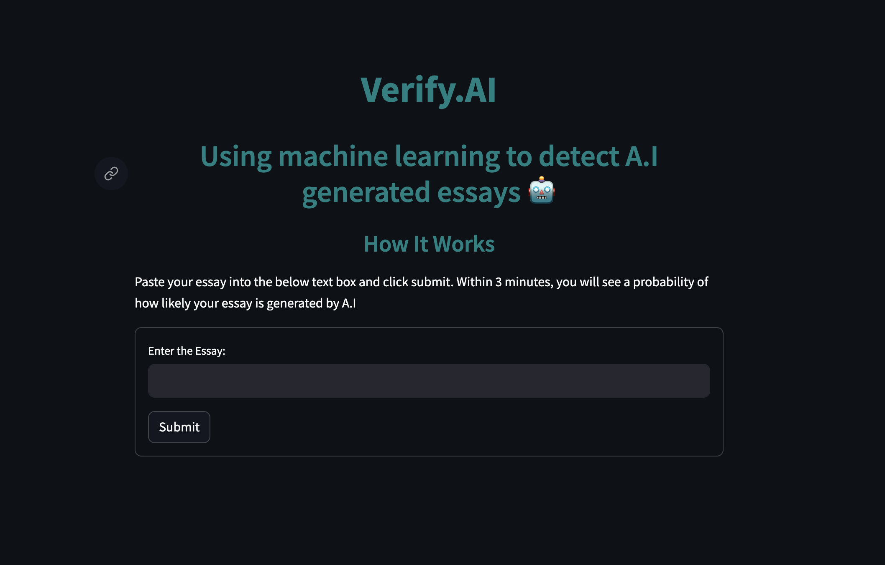
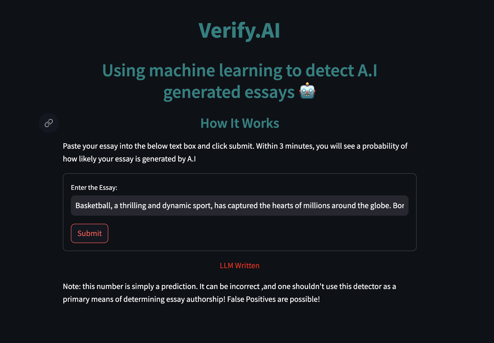

# verify-ai
   
Using machine learning to detect A.I generated essays.

## Problem
The rise of large language models (LLMs) has caused many folks to be concerned that LLMs will replace everyday human jobs. Specifically, educators are concerned that students may use LLMs to submit essays that are not their own. As a result, the students’ writing skills may deteriorate and their creative thinking ability may falter. In this project, I aim to tackle the following problem: how can we accurately assess whether a submitted essay was written by a large language model or written by a student?

## Problem Details
The problem is a classic binary classification problem (supervised learning) as the solution will simply verify whether an essay was written by a student or a LLM. To see how well my solution works, I will enter it into the [LLM - Detect AI Generated Text](https://www.kaggle.com/competitions/llm-detect-ai-generated-text) on Kaggle. Even though the test data (competition data) will have some engineered noise, I can utilize it as a metric to see how well my model is able to perform.

The challenge evaluates solutions based on the Receiver Operator Curve (ROC) Area Under the Curve (AUC); hence, I will use the ROC AUC as my evaluation metric. 

## Application
The application is live! You can go directly to [https://verifyai.streamlit.app/](https://verifyai.streamlit.app/) to play with the project! All you need to do is paste your essay into the text box and in a couple minutes, you will see a prediction! Here is an example on how to use the app:

 

## References
This project wouldn't have been built without the help of some resources. In this section, I provide links to data sources & research papers I utilized to guide my approach.

### Data

1. [LLM - Detect AI Generated Text](https://www.kaggle.com/competitions/llm-detect-ai-generated-text)
2. [daigt data - llama 70b and falcon 70b](https://www.kaggle.com/datasets/nbroad/daigt-data-llama-70b-and-falcon180b?select=falcon_180b_v1.csv)
3. [1000 Essays from Antrophic](https://www.kaggle.com/datasets/darraghdog/hello-claude-1000-essays-from-anthropic)
4. [LLM-generated essay using PaLM from Google Gen-AI](https://www.kaggle.com/datasets/kingki19/llm-generated-essay-using-palm-from-google-gen-ai)
5. [persuade corpus 2.0](https://www.kaggle.com/datasets/nbroad/persaude-corpus-2/?select=persuade_2.0_human_scores_demo_id_github.csv)
6. [DAIGT | External Dataset](https://www.kaggle.com/datasets/alejopaullier/daigt-external-dataset)
7. [ArguGPT](https://www.kaggle.com/datasets/alejopaullier/argugpt?select=argugpt.csv)
8. [essays-with-instructions](https://huggingface.co/datasets/ChristophSchuhmann/essays-with-instructions)

### Papers

1. [ArguGPT: evaluating, understanding and identifying argumentative essays generated by GPT models](https://arxiv.org/abs/2304.07666)
2. [Generative AI Text Classification using Ensemble LLM Approaches](https://arxiv.org/pdf/2309.07755.pdf)
3. [Classification of Human-and AI-Generated Texts: Investigating Features for ChatGPT](https://arxiv.org/pdf/2308.05341.pdf)
4. [Will ChatGPT get you caught? Rethinking of Plagiarism Detection](https://arxiv.org/pdf/2302.04335.pdf)
5. [On the Possibilities of AI-Generated Text Detection](https://arxiv.org/abs/2304.04736)
6. [Release Strategies and the Social Impacts of Language Models](https://d4mucfpksywv.cloudfront.net/papers/GPT_2_Report.pdf)

### Other Resources

1. [RoBERTa Base OpenAI Detector](https://huggingface.co/roberta-base-openai-detector)
2. [Emotion English DistilRoBERTa-base](https://huggingface.co/j-hartmann/emotion-english-distilroberta-base)

## Author
If you have any questions about the project, feel free to reach out to me on [LinkedIn](https://www.linkedin.com/in/jinalshah2002/)!
